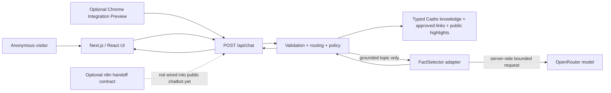
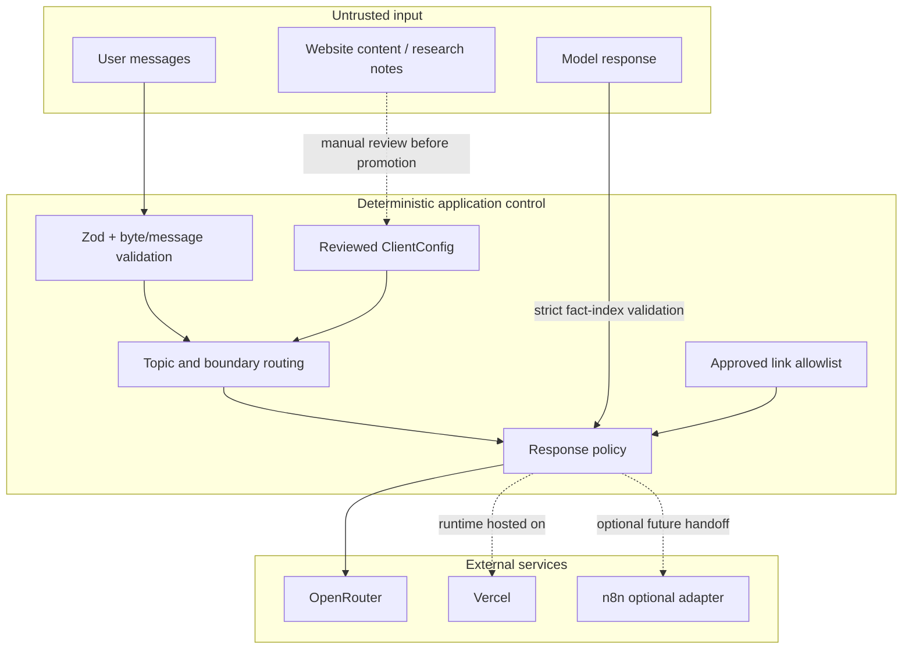

# Architecture overview

Status: **PX6 revision 15 DONE + PUBLIC PASS** as of 2026-09-11. Runtime repair `af7e3ff` is published in closure `f334616`, GitHub CI `34562930679` PASS, existing-project Vercel deployment `dpl_DHvLHiEaTGgtDJNXEENugKER8HLr` is Ready, and the complete rate-aware public browser matrix is 70/70 PASS. Historical r13/r14 failures remain in the append-only Graph evidence.

## One-sentence mental model

The product is a **profile-composed deterministic support system with a bounded model-assisted fact selector**: `ClientConfig` decides factual/link/boundary authority and reviewed public presentation facts, `PersonaProfile` may add one validated grounded diagnostic question plus short tone-only boundary empathy, and `ExperienceProfile` drives presentation and first-turn prompts. The model can only choose an ordering/subset of already-approved fact indices.

## System context



The Chrome adapter and n8n workflow are deliberately separate stretch integrations. Neither changes the core knowledge, policy, or provider authority.

## Runtime request sequence

```mermaid
sequenceDiagram
    actor U as User
    participant UI as Browser UI
    participant API as /api/chat
    participant C as Core policy
    participant K as ClientConfig
    participant P as FactSelector
    participant M as OpenRouter

    U->>UI: Send message
    UI->>API: Bounded message history
    API->>API: Content type, byte, schema, rate/deadline checks
    API->>C: Validated messages
    C->>K: Route against approved topics and boundaries

    alt greeting, boundary, clarification, or unsupported request
        C-->>API: Deterministic reply kind + client-owned boundary copy
        API->>API: Optional persona tone lead only
    else grounded topic
        C->>P: Eligible knowledge entry + bounded history
        P->>M: Numbered approved facts; request indices only
        M-->>P: Strict JSON indices
        P-->>C: Validated indices
        C->>K: Reassemble approved facts + exact approved links
        C-->>API: Grounded reply
    end

    API-->>UI: reply + kind
    UI-->>U: Text-only render; exact allowlisted links only
```

## Trust boundaries



**Rule:** untrusted text can influence a request, but it cannot promote itself into authoritative facts, credentials, destinations, or executable instructions.

## Component ownership

| Area | Primary paths | Owns | Does not own |
|---|---|---|---|
| Client configuration | `src/config/` | Six topics, verified facts/provenance, primary + explicitly delegated approved URL hosts, `publicHighlights`, pricing/unsupported/account boundaries | Persona behavior, experience styling, secrets, accounts, network calls |
| Product composition | `src/product/` | Product/persona/experience schemas, Donna profile, allowlisted registry, one-question initiative, tone-only `boundaryVoice`, quick prompts, safe browser projection | New factual authority, provider credentials, autonomous actions |
| Conversation core | `src/core/` | Validation, deterministic routing, clarification, reply policy | React, network, provider credentials |
| Provider | `src/provider/` | Mock/OpenRouter fact selection, deadlines, retry and spend controls | Final business authority, arbitrary URLs |
| Server | `src/server/`, `app/api/` | HTTP admission, orchestration, safe error translation, process-local rate limiting | UI state |
| UI | `src/ui/`, `app/` | Website shell, profile-driven avatar/copy/theme/quick prompts, public-highlight presentation, interaction state, accessible controls, exact approved links | New facts, provider secrets, routing decisions or policy override |
| Chrome preview | `extension/` | Local launcher/panel and fixed-endpoint transport on approved Cadre origins | Host-page scraping, cookies, arbitrary proxying |
| CI/CD | `.github/workflows/` | Repeatable verification and exact-SHA Vercel delivery | Creating a replacement Vercel project |
| n8n prototype | `integrations/n8n/` | Consent-checked structured human-handoff contract | Real delivery until a provider/recipient is configured |
| Execution governance | `graph-harness.*`, `progress/`, `evidence/` | Append-only state/evidence and release gates | Product runtime behavior |

## Why this is not vector RAG

The corpus is small and curated. Retrieval uses deterministic topic/keyword routing into typed entries; there are no embeddings, vector database, similarity scores, chunk retrieval, or runtime document ingestion. Calling it RAG would overstate the implementation. The useful design property is **grounding with inspectable provenance**, not a particular retrieval technology.

If the corpus grows enough that deterministic routing becomes brittle, a semantic/hybrid retriever could be added **behind the same knowledge-selection boundary**. Graph retrieval is justified only when relationship-heavy entity queries become a first-class requirement. Its result would still need to resolve to reviewed facts and links before generation; GraphRAG is intentionally not part of the current product.

## Product composition and Donna

`src/product/active.ts` resolves only explicitly registered profiles and defaults safely to `cadre-donna`; unknown IDs do not become module paths. The active profile composes reviewed Cadre knowledge with the English Donna persona and a validated web experience.

After a grounded reply is assembled, `src/product/conversation.ts` may append one configured Donna diagnostic question for that topic. The schema rejects URL-shaped, multiline, multi-question or bundled-statement guidance, and narrow user opt-out language suppresses it. For non-grounded boundaries, `boundaryVoice` may add only a short empathy lead; deterministic policy still owns whether the result is pricing/unsupported/account/unknown and still owns the client-approved handoff text and URL.

`chatExperience()` projects product ID, client/contact/exact approved links, starter labels, `ExperienceProfile`, and explicitly reviewed `publicHighlights` to the browser. Link validation stays generic: a client may declare a small `additionalOfficialDomains` allowlist when its own public site links to a separate product host; Cadre currently delegates only the observed `portal.gocadre.ai` host rather than the broader sibling domain. It does not project the full knowledge corpus, routing trigger lists, persona operating principles, provider configuration, or credentials. The fictional Acme Outdoors + Scout fixture validates that the same shell can project a different persona/theme/copy without leaking Cadre/Donna presentation; it is not registered for production use.

## PX6 website + floating Donna presentation

The active Cadre experience is now **website-first** rather than a permanent split-screen chat. The public page uses the existing local ambient video, client-owned public outcome/proof/result highlights, and a plain-language trust section. Donna enters through a floating launcher and opens a bounded chat panel; the launcher can show one reviewed public fact and one configured suggested question before the chat starts. It does not infer personal intent or inspect account/page data.

The original `signal-orb` has two product states: `idle` and `shaping`. A single launcher glare sweep is the only other new PX6 motion. `prefers-reduced-motion` removes orb/glare animation and preserves the poster-only hero behavior. The UI never imports third-party orb/glare/video code or assets.

## Advanced concepts, briefly

### Deterministic control plane vs probabilistic selector

The model is not the application controller. Deterministic code decides admissibility, routing, boundaries, facts, links, budgets, and error behavior. The model performs one narrow probabilistic task: choosing fact indices. This reduces the blast radius of model variability.

### Fail closed

When live-provider configuration is invalid, expired, malformed, over budget, or otherwise unsafe, the system returns a controlled failure. It does **not** silently switch to mock mode or invent an answer. A failure is preferable to falsely claiming live or grounded behavior.

### Adapter boundary

`FactSelector` and the proposed `HumanHandoffProvider` are examples of adapters: application code depends on a small capability contract rather than a vendor implementation. OpenRouter or n8n can be replaced without moving vendor-specific behavior into the domain core.

### Event-sourced execution graph

Graph Harness keeps a frozen node baseline plus append-only events. Current state is reconstructed by replaying events; old failures are not overwritten by later successes. This is process governance, not part of the chatbot runtime.

### Exact-SHA release

A release should identify one Git commit, build that source, deploy that build, and verify the resulting URL. “Vercel says READY” is not enough if the public alias still serves an older snapshot.

### Process-local controls

Rate limits and application budget reservations live in one server process. Serverless instances can restart or scale horizontally, so those counters are **best-effort**, not distributed guarantees. The provider-enforced key limit is the stronger spend boundary.

## Optional surfaces

### Chrome Integration Preview

The extension derives only a fixed presentation context from an allowlisted Cadre pathname/hash. For example, `/agents#discover-agents` can show agent-specific local copy and a fixed suggested question. It never scrapes the host page to manufacture context. See `extension/README.md`.

### n8n human handoff

The current n8n workflow proves a consent/validation/routing contract and controlled webhook responses. It is not connected to a real Cadre mailbox, so the product must not say that a message was sent. See `integrations/n8n/README.md`.

## Where to go next

A developer changing runtime behavior should start with `CLAUDE.md`, then `docs/developer-handoff.md`, the relevant source module, and its tests. A developer preparing a release should use `docs/release-runbook.md` and `progress/checkpoint.md`.
