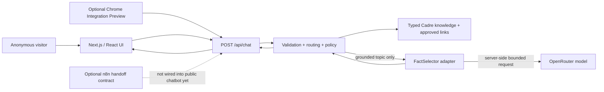
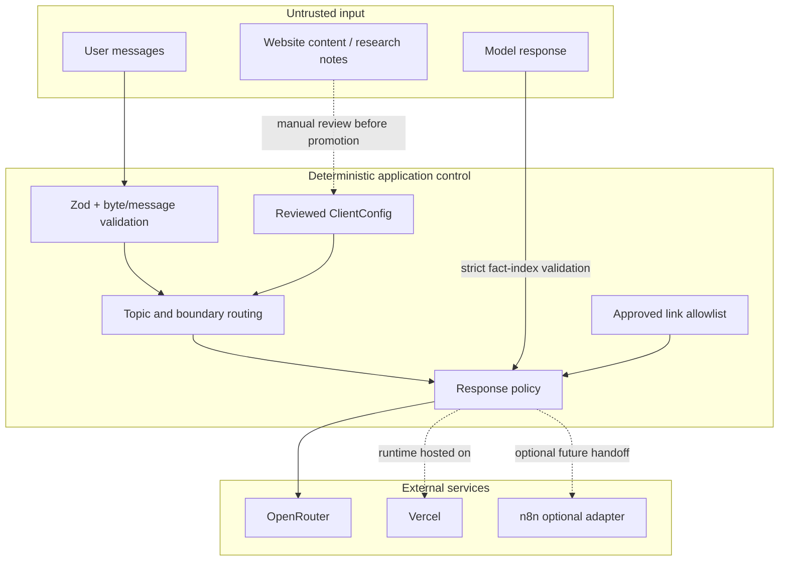

# Architecture overview

Status: **implemented and locally verified** as of 2026-09-09. This document explains the current design; release status and blockers live in `progress/checkpoint.md` and the Graph Harness ledgers.

## One-sentence mental model

The product is a **deterministic support system with a bounded model-assisted fact selector**: application code decides what topic is allowed, which verified facts are eligible, what safety boundary applies, and which URLs may render; the model can only choose an ordering/subset of already-approved fact indices.

## System context



The Chrome adapter and n8n workflow are deliberately separate stretch integrations. Neither changes the core knowledge, policy, or provider authority.

## Runtime request sequence

```mermaid
sequenceDiagram
    actor U as User
    participant UI as Browser UI
    participant API as /api/chat
    participant C as Core policy
    participant K as ClientConfig
    participant P as FactSelector
    participant M as OpenRouter

    U->>UI: Send message
    UI->>API: Bounded message history
    API->>API: Content type, byte, schema, rate/deadline checks
    API->>C: Validated messages
    C->>K: Route against approved topics and boundaries

    alt greeting, boundary, clarification, or unsupported request
        C-->>API: Deterministic reply kind
    else grounded topic
        C->>P: Eligible knowledge entry + bounded history
        P->>M: Numbered approved facts; request indices only
        M-->>P: Strict JSON indices
        P-->>C: Validated indices
        C->>K: Reassemble approved facts + exact approved links
        C-->>API: Grounded reply
    end

    API-->>UI: reply + kind
    UI-->>U: Text-only render; exact allowlisted links only
```

## Trust boundaries



**Rule:** untrusted text can influence a request, but it cannot promote itself into authoritative facts, credentials, destinations, or executable instructions.

## Component ownership

| Area | Primary paths | Owns | Does not own |
|---|---|---|---|
| Client configuration | `src/config/` | Brand, six topics, verified facts, provenance, approved URLs, boundary copy | Secrets, accounts, network calls |
| Conversation core | `src/core/` | Validation, deterministic routing, clarification, reply policy | React, network, provider credentials |
| Provider | `src/provider/` | Mock/OpenRouter fact selection, deadlines, retry and spend controls | Final business authority, arbitrary URLs |
| Server | `src/server/`, `app/api/` | HTTP admission, orchestration, safe error translation, process-local rate limiting | UI state |
| UI | `src/ui/`, `app/` | Interaction state, accessible controls, text rendering, approved-link presentation | Provider secrets or policy override |
| Chrome preview | `extension/` | Local launcher/panel and fixed-endpoint transport on approved Cadre origins | Host-page scraping, cookies, arbitrary proxying |
| CI/CD | `.github/workflows/` | Repeatable verification and exact-SHA Vercel delivery | Creating a replacement Vercel project |
| n8n prototype | `integrations/n8n/` | Consent-checked structured human-handoff contract | Real delivery until a provider/recipient is configured |
| Execution governance | `graph-harness.*`, `progress/`, `evidence/` | Append-only state/evidence and release gates | Product runtime behavior |

## Why this is not vector RAG

The corpus is small and curated. Retrieval uses deterministic topic/keyword routing into typed entries; there are no embeddings, vector database, similarity scores, chunk retrieval, or runtime document ingestion. Calling it RAG would overstate the implementation. The useful design property is **grounding with inspectable provenance**, not a particular retrieval technology.

If the corpus grows enough that deterministic routing becomes brittle, a semantic retriever could be added **behind the same knowledge-selection boundary**. Its result would still need to resolve to reviewed facts and links before generation.

## Advanced concepts, briefly

### Deterministic control plane vs probabilistic selector

The model is not the application controller. Deterministic code decides admissibility, routing, boundaries, facts, links, budgets, and error behavior. The model performs one narrow probabilistic task: choosing fact indices. This reduces the blast radius of model variability.

### Fail closed

When live-provider configuration is invalid, expired, malformed, over budget, or otherwise unsafe, the system returns a controlled failure. It does **not** silently switch to mock mode or invent an answer. A failure is preferable to falsely claiming live or grounded behavior.

### Adapter boundary

`FactSelector` and the proposed `HumanHandoffProvider` are examples of adapters: application code depends on a small capability contract rather than a vendor implementation. OpenRouter or n8n can be replaced without moving vendor-specific behavior into the domain core.

### Event-sourced execution graph

Graph Harness keeps a frozen node baseline plus append-only events. Current state is reconstructed by replaying events; old failures are not overwritten by later successes. This is process governance, not part of the chatbot runtime.

### Exact-SHA release

A release should identify one Git commit, build that source, deploy that build, and verify the resulting URL. “Vercel says READY” is not enough if the public alias still serves an older snapshot.

### Process-local controls

Rate limits and application budget reservations live in one server process. Serverless instances can restart or scale horizontally, so those counters are **best-effort**, not distributed guarantees. The provider-enforced key limit is the stronger spend boundary.

## Optional surfaces

### Chrome Integration Preview

The extension derives only a fixed presentation context from an allowlisted Cadre pathname/hash. For example, `/agents#discover-agents` can show agent-specific local copy and a fixed suggested question. It never scrapes the host page to manufacture context. See `extension/README.md`.

### n8n human handoff

The current n8n workflow proves a consent/validation/routing contract and controlled webhook responses. It is not connected to a real Cadre mailbox, so the product must not say that a message was sent. See `integrations/n8n/README.md`.

## Where to go next

A developer changing runtime behavior should start with `CLAUDE.md`, then `docs/developer-handoff.md`, the relevant source module, and its tests. A developer preparing a release should use `docs/release-runbook.md` and `progress/checkpoint.md`.
