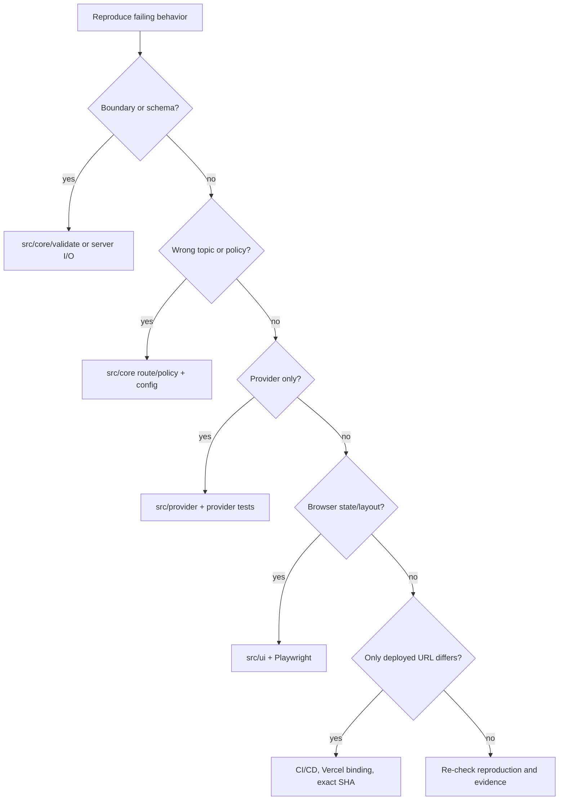

# Developer handoff

Audience: a mid-level TypeScript/Next.js developer taking over maintenance or finishing the release. This is a practical guide, not a second specification.

## First 30 minutes

Read in this order:

1. `CLAUDE.md` — durable engineering rules, commands, security and evidence boundaries.
2. `progress/checkpoint.md` (and `progress/checkpoint-premium.md` while the premium graph exists) — exact current state and blockers.
3. `docs/architecture-overview.md` — mental model and diagrams.
4. `specs/001-support-chatbot/requirements.md` — approved product scenarios and acceptance criteria.
5. `docs/component-inventory.md` — detailed contracts and invariants.
6. `docs/release-runbook.md` — production closure path.

Then run:

```sh
git status -sb
npm ci
npm test
npm run typecheck
npm run lint
npm run build
npm run graph -- validate
npm run graph -- status --pretty
```

Do not start by refactoring. First identify the active Graph node. The released PX5 baseline is green; the current PX6 source is deliberately unverified until its critic/fixer assembly finishes. Resume from that lifecycle state rather than treating older 288/58 results as proof for the changed source.

## The mental model to keep

When a request arrives, think in this order:

1. **Can we safely accept the request?** HTTP, size, schema, deadline, rate limit.
2. **Is there a deterministic policy outcome?** greeting, private/account question, unverified claim, ambiguity, unsupported request.
3. **Which allowlisted product is active?** Production defaults to `cadre-donna`; product IDs never become dynamic module paths.
4. **Which reviewed Cadre topic owns it?** deterministic routing.
5. **If grounded, which approved facts are eligible?** typed `ClientConfig` only.
6. **The model may select fact indices.** It does not create new authority.
7. **The server reassembles the answer and approved URLs.**
8. **Donna may add one app-owned diagnostic question.** Grounded only; explicit opt-out suppresses it.
9. **The UI renders the validated experience profile and inert text.** It does not receive factual authority or model HTML.

If a proposed change skips one of those boundaries, examine it carefully.

## Repository map

```text
app/                         Next.js page + API routes + global CSS
src/config/                  Client knowledge, approved links, boundaries
src/product/                 Product/persona/experience contracts, Donna, registry, view projection
src/core/                    Pure validation, routing and response policy
src/provider/                Mock/OpenRouter FactSelector implementations
src/server/                  HTTP orchestration, I/O limits, rate limiting
src/ui/                      Conversation helpers and React chat UI
tests/                       Unit/integration tests
e2e/                         Playwright browser regressions
extension/                   Optional Manifest V3 integration preview
integrations/n8n/            Optional human-handoff workflow contract
.github/workflows/           CI and gated production delivery
specs/001-support-chatbot/   Approved requirements/design/tasks baseline
progress/                    Checkpoints, decisions, graph ledgers
evidence/                    Sanitized test/review/deployment evidence
tools/graph-adapter/         Thin bridge to pinned external Graph Harness
```

## Common change recipes

### Update a Cadre fact or link

1. Verify the exact official Cadre page.
2. Record the source/retrieval context under `docs/research/` or the knowledge audit.
3. Change `src/config/cadre.ts`; do not put raw scraped text into prompts.
4. Keep URLs inside the official allowlist contract.
5. Run config/routing/policy/API tests and the full suite.
6. Get a separate review for factual wording.

Never infer pricing, certifications, portal URLs, SLAs, or completed actions from marketing language.

### Add or adjust routing language

Work in `src/core/route.ts` and client routing vocabulary. Test ambiguity, overlapping aliases, boundary precedence, and the second-client fixture. Do not “solve” missed routing by sending every message to the model.

### Add or change a persona / experience

Keep the three authorities separate. Facts/links/boundaries stay in `ClientConfig`; persona voice and bounded initiative stay in `PersonaProfile`; page copy/theme/avatar stay in `ExperienceProfile`. For v1, proactive guidance is one schema-validated diagnostic question per existing topic and cannot carry URLs or bundled instructions. Preserve explicit user opt-out.

The visible `assistantLabel` must match `persona.name`. Register production products explicitly in `src/product/active.ts`; do not dynamically import a profile from user/env input. Use the fictional `src/product/fixtures/acme-scout.ts` and `tests/product/view.test.ts` as the reuse regression: a second profile must project without Cadre/Donna presentation leakage.

Do not add vector retrieval or GraphRAG merely because profiles are modular. Retrieval evolution is a separate decision triggered by observed corpus/query failure.

### Change the model/provider

Keep `FactSelector` stable if possible. A provider implementation must preserve strict JSON index output, input/output bounds, cancellation, retry policy, expiry/budget checks, and server-only credentials. Run provider tests plus a bounded live comparison before changing the production default.

### Change the UI

Preserve the UX-01–09 contract in `CLAUDE.md`. Run unit tests, build, and Playwright desktop/mobile. Pay particular attention to hydration, IME/keyboard behavior, single-flight submission, Stop/retry, stale replies after reset, 320/360px reflow, text-spacing overrides, focus, and exact-link rendering.

### Add a new contextual Chrome page

Add only a fixed pathname/hash → enum mapping. The enum may select local copy and a fixed question. Do not read page text, forms, cookies, storage, or arbitrary URLs. Run extension build/tests and synthetic browser verification; actual-site verification is owner-gated and is not a routine CI step.

### Promote the n8n handoff into the app

Introduce a small `HumanHandoffProvider` contract in application code. n8n should implement that adapter. Require explicit consent, bounded structured data, success acknowledgement and a real approved delivery provider before the UI can say that a handoff was sent. Keep recipient addresses and credentials out of source.

## Debugging ladder

Use the narrowest layer that can explain the failure:



Do not patch UI symptoms for a routing defect, or change provider prompts for a deterministic policy defect.

## Advanced concepts in plain language

### Bounded inference

We give the model a small menu of verified facts and ask it for indices, not an unrestricted company answer. The smaller contract makes validation and failure behavior tractable.

### Single-flight

Only one chat request may own the current UI operation at a time. Stop/reset changes operation identity so a late network response cannot append itself after the user has moved on.

### Idempotency vs deduplication

The extension rejects duplicate request IDs and never automatically retries ambiguous requests. That prevents accidental double actions. This is not a general distributed idempotency system; it is a bounded client transport guarantee.

### Optimistic event guard

Graph writes use the expected last event ID. If another writer changed the ledger, the mutation should fail rather than append against stale state. This is why only one coordinator writes the ledger.

### Evidence category

A unit test, a synthetic browser test, a live local inference, a public deployment check, and an extracted ZIP verification prove different things. Never use one as shorthand for another.

## Definition of done for a change

- The intended behavior and boundary are explicit.
- The smallest relevant tests fail before/fix after when practical.
- Full lint, typecheck, tests and build remain green for runtime changes.
- Browser/extension checks run when their surface changed.
- No secret/private input is staged.
- Docs are updated only where the durable contract changed.
- Independent verification is obtained when the graph gate requires it.
- A local green build is not called “deployed.”
- Deployment is not called current until the public URL is checked against the exact release markers.

## Things not to “clean up” casually

- Do not regenerate or hand-edit `graph-harness.project.json` after events exist.
- Do not rewrite historical FAIL/BLOCKED evidence into PASS.
- Do not rewrite Git history to improve apparent provenance.
- Do not replace deterministic boundaries with free-form model reasoning.
- Do not add a database/vector store/GraphRAG/CRM/auth layer without a concrete requirement.
- Do not put secrets, real recipients, or provider credentials in tracked files.

## Escalate before changing

Escalate to the project owner before: new paid services, new persistent data, auth/account access, schema-wide API changes, new external recipient/delivery credentials, broader Chrome permissions, Web Store publication, changing spend limits, or declaring final release closure.
