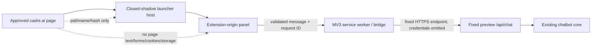

# Chrome Integration Preview design

Status: **G9 DONE at the local-preview scope** as of 2026-09-09. `security-review=PASS`, `independent-verification=PASS`, `integration-proof=PASS`. PX4 now applies a presentation-only Donna refinement on top of that proven adapter boundary. This remains a locally loaded independent integration, not a Cadre-installed or endorsed production feature and not a Chrome Web Store release.

The original proposal evolved during implementation. Historical FAIL/BLOCKED evidence is retained under `extension/evidence/`; the current execution state is authoritative in `progress/extension-graph.events.jsonl` and `progress/checkpoint.md`.

## Product purpose

The public chatbot URL remains the required product. The Manifest V3 extension demonstrates how the same assistant could appear as a floating launcher on approved Cadre pages without changing Cadre servers or building a second chatbot.

It is a **presentation/transport adapter** for the existing API, knowledge, response policy and approved links.

## Boundary



### Host authority

- Exact approved origins only: `https://cadre.ai/*` and `https://www.cadre.ai/*`.
- Top-frame, isolated-world content script.
- No `tabs`, history, cookies, credentials or storage permission.
- No generic page-script bridge and no arbitrary network proxy.
- One launcher per document; teardown aborts pending work and releases listeners.

### Network authority

The service worker/bridge sends chat traffic only to the fixed configured preview API. A panel message never supplies a destination URL. Fetch uses bounded JSON, omitted credentials, no-store behavior, no referrer, and rejects redirects.

OpenRouter configuration and server credentials never enter the extension bundle.

## URL-aware context

The extension may derive a **fixed enum** from the current approved Cadre pathname/hash. This is presentation context, not knowledge retrieval.

Example:

```text
/agents#discover-agents
        |
        v
pageContext = "agents-discover"
        |
        +--> local label/copy
        +--> one fixed suggested grounded question
```

For the current agents page the panel can use agent-specific, lightly humorous local copy and suggest “How does Cadre approach AI agents?” The extension does **not** scrape the page to decide what to say.

This distinction matters: URL context is a small auditable allowlist; DOM scraping would make arbitrary mutable page content part of the assistant's authority and enlarge the injection/privacy surface.

## Panel isolation and rendering

The launcher uses a closed Shadow DOM for style encapsulation. The conversation panel is extension-origin content. Shadow DOM is not treated as a security sandbox by itself.

Model replies render as text. Only exact application-approved URLs become links. Unknown HTML, scripts, images, iframes or model-supplied destinations are not rendered as executable content.

Conversation state is volatile; no sensitive chat storage permission is requested.

## Transport behavior

- Request IDs are bounded and deduplicated.
- One pending request is allowed per panel.
- Duplicate IDs do not trigger another fetch.
- Cancellation, panel disconnect, host disconnect and timeout abort the in-flight request.
- Ambiguous failures are not automatically retried.
- HTTP/provider details are translated into bounded safe error codes; upstream response bodies are not leaked.

## Verification

Current verified boundaries:

- **72/72** extension unit/security/build tests PASS.
- Original G9 proof: **23/23** synthetic browser checks PASS with zero real-site/API traffic; latest repaired PX4 proof: **24/24** PASS with the added computed-style readability regression.
- Latest owner-authorized disposable Chromium installed-site run on `https://cadre.ai/agents#discover-agents`: **17 scoped checks PASS**, exactly one request to the fixed preview API for one approved question.
- Granite bounded security/context review PASS.

Current repaired PX4 evidence: `extension/evidence/px4-fix-actual-site-20260909/`, `extension/evidence/px4-fix-contextual-donna-20260909/`, `extension/evidence/px4-verifier-20260909/`, and `evidence/premium-context/`. Earlier G9 evidence remains retained under its original paths.

Two earlier actual-site test defects are retained rather than erased: one whole-page overflow assertion attributed Cadre's existing site overflow to the extension, and one Page-scoped network observer did not see service-worker traffic. The tests were corrected before the final PASS.

## What is not proven

- Chrome Web Store packaging/review/publication.
- Cadre production ownership, installation or endorsement.
- Every Chrome version or physical reviewer device.
- Any permission beyond the current minimal manifest.
- That the public chatbot deployment is current; extension integration proof and Vercel release equivalence are separate claims.

## Developer change rule

A new contextual experience must be implemented as an explicit pathname/hash -> enum mapping plus local copy/suggested-question mapping. If the requested feature needs page content, cookies, account state, arbitrary destinations, new permissions, persistent storage or Cadre server changes, stop and treat it as a new security/scope decision rather than extending this contract silently.
