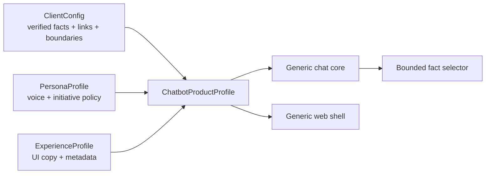
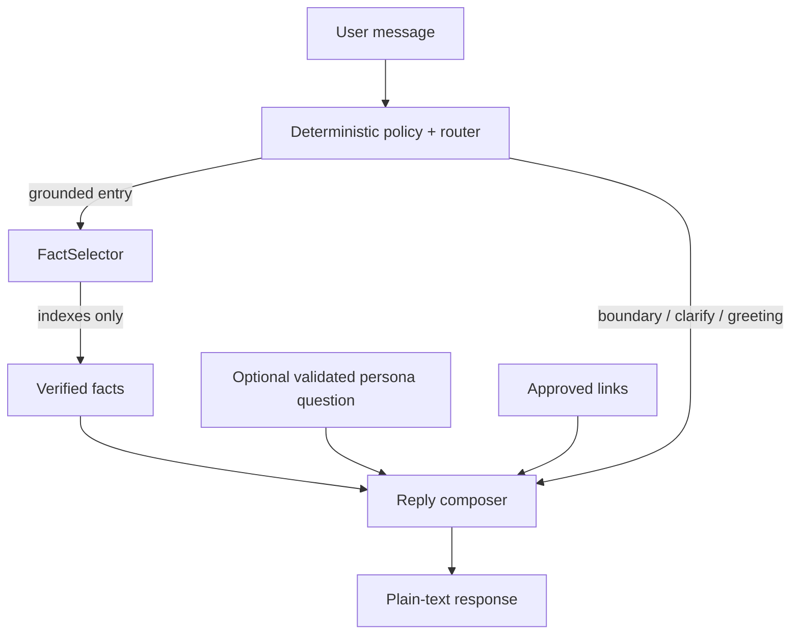

# Productized conversational assistant architecture

Status: **implemented and locally verified**, 2026-09-09. P1–P3 are DONE with all blocking productization gates PASS; public promotion of this productized line is tracked separately in `progress/checkpoint.md`.

## Product hypothesis

The chatbot is a reusable **conversational system block**, not a Cadre-specific page. A deployable product profile composes three independently owned surfaces:

- `ClientConfig` owns what the system may assert and where it may link.
- `PersonaProfile` owns how the assistant behaves conversationally without gaining factual authority.
- `ExperienceProfile` owns how the reusable UI presents the product.
- `ChatbotProductProfile` is the validated composition root and deployable unit.

## Donna

Donna is an original project-owned persona. Her job is not to sound theatrical; it is to reduce the user's next decision. Her operating rule is **answer first, then take one justified step forward**.

Mindset:

1. Information is table stakes; usefulness means reducing the next decision.
2. Answer the question before offering anything else.
3. Prefer one sharp next move over a menu of possibilities.
4. Never invent facts, urgency, commitments, pricing, security claims, or capabilities.
5. If there is no approved grounded next step, stop.

The first version is intentionally deterministic. `PersonaProfile.proactive.byTopic` may contain **one validated diagnostic question** for an existing client topic. Application code may append that exact question only after a grounded reply and only when `maxSteps=1`; greetings, clarification, redirects and declines never receive persona guidance. URL-shaped text, bundled statements and multi-question strings are rejected by the profile schema. If the latest user message explicitly asks for no follow-up (`just answer`, `no questions`, etc.), the optional question is suppressed. This keeps initiative inspectable and prevents the persona layer from becoming an unbounded agent.

## Trust boundary

The live model still returns only fact indexes. Persona behavior never changes client routing, approved links, boundary precedence, or provider credentials. The visible assistant label is validated to match the selected persona name so presentation identity cannot silently drift from behavior identity.

## Reuse rule

A change belongs in the reusable module when it can be expressed through the validated contracts without branching on a client name. Client-specific facts, vocabulary, contact details, and suggested next steps remain client configuration. Persona-specific conversational behavior remains persona configuration. Brand copy remains experience configuration.

A second fixture/profile must pass the same core without copying the engine. The current proof is fictional **Acme Outdoors + Scout**: it composes a different client, persona, copy and theme through the same contracts, and the projected browser view is tested for zero Cadre/Donna presentation leakage. Scout is a test/architecture fixture only and is not in the production registry. That proof is intentionally stronger than renaming a bot because it exercises the abstraction boundary.

## Browser projection and experience boundary

`chatExperience()` is the server-side projection consumed by the React shell. It exposes only the product ID, client name, contact/approved links, starter-topic labels and validated `ExperienceProfile`. Verified facts, provenance, routing triggers and Donna's operating principles remain on the server.

The shared UI has no client/persona-name branches. The experience profile controls page metadata, assistant label, copy, strict hex theme tokens, an original orbital-monogram AI-guide avatar, and the composer prompt. Cadre's active product uses Donna with a `D` avatar and the initial prompt **“What are you trying to figure out?”**.

## Retrieval evolution: why not GraphRAG

The current Cadre corpus is small, curated and already routed deterministically. GraphRAG would add entity extraction/resolution, graph storage, graph-query/retrieval behavior and a larger evaluation surface without solving an observed retrieval failure. That would conflict with the challenge's scope discipline.

Keep the current typed curated retrieval until evidence shows it failing. A future retrieval adapter can be introduced behind the knowledge-selection boundary when needed: curated → semantic/vector or hybrid → graph retrieval only if relationship-heavy queries become a first-class requirement. Any future retriever must still resolve to reviewed facts/links before the response composer can assert them.
