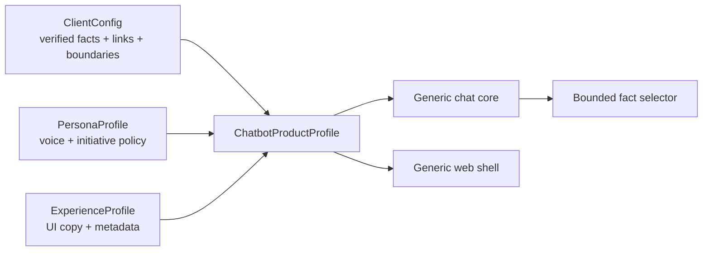
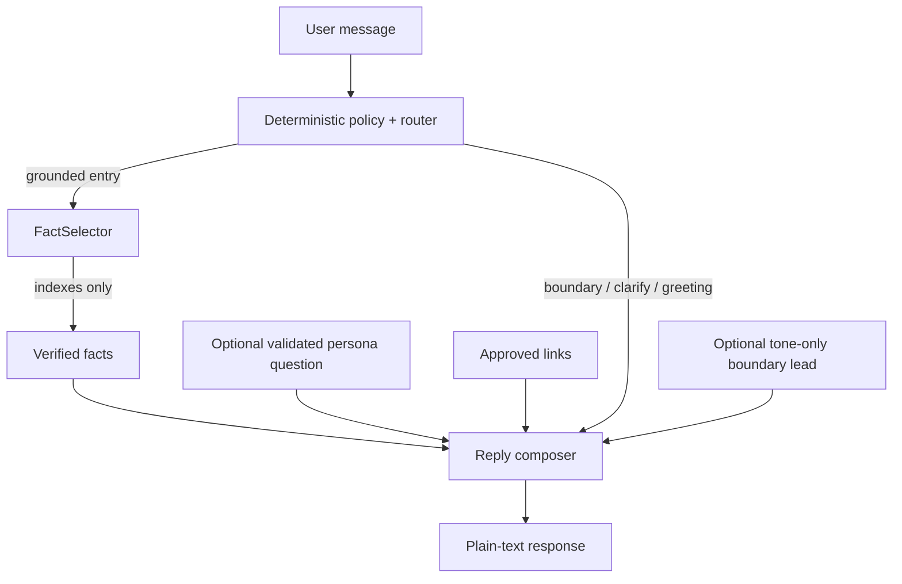

# Productized conversational assistant architecture

Status: **P1–P3 productization released and PX6 revision 15 DONE + PUBLIC PASS**, 2026-09-11. Runtime repair `af7e3ff` is contained in published closure `f334616`, verified by GitHub CI `34562930679`, the existing-project production deployment, and a complete rate-aware 70/70 public browser matrix. Historical revision failures remain retained in Graph evidence.

## Product hypothesis

The chatbot is a reusable **conversational system block**, not a Cadre-specific page. A deployable product profile composes three independently owned surfaces:

- `ClientConfig` owns what the system may assert, where it may link, deterministic boundaries, pricing-boundary framing, and reviewed public presentation facts (`publicHighlights`). The primary `officialDomain` can be supplemented by a small explicit `additionalOfficialDomains` allowlist for observed client-linked product hosts; Cadre currently delegates only `portal.gocadre.ai`, while undeclared sibling/foreign hosts remain rejected.
- `PersonaProfile` owns how the assistant behaves conversationally without gaining factual authority. It may add one configured grounded follow-up and short boundary-empathy leads only.
- `ExperienceProfile` owns how the reusable UI presents the product, including the avatar style and high-value first-turn prompts.
- `ChatbotProductProfile` is the validated composition root and deployable unit.

## Donna

Donna is an original project-owned persona. Her job is not to sound theatrical; it is to reduce the user's next decision. Her operating rule is **answer first, then take one justified step forward**.

Mindset:

1. Information is table stakes; usefulness means reducing the next decision.
2. Answer the question before offering anything else.
3. Prefer one sharp next move over a menu of possibilities.
4. Never invent facts, urgency, commitments, pricing, security claims, or capabilities.
5. If there is no approved grounded next step, stop.

The initiative contract is intentionally deterministic. `PersonaProfile.proactive.byTopic` may contain **one validated diagnostic question** for an existing client topic. Application code may append that exact question only after a grounded reply and only when `maxSteps=1`; explicit opt-out language (`just answer`, `no questions`, etc.) suppresses it. Separately, `PersonaProfile.boundaryVoice` may prepend one short tone-only empathy lead to pricing, unsupported, unknown, ambiguous, or account-specific boundaries. Those leads are schema-bounded, single-line, URL-free, and cannot change the decision kind, approved facts, links, or handoff destination. This keeps initiative inspectable without turning Donna into an unbounded agent.

## Trust boundary

The live model still returns only fact indexes. Persona behavior never changes client routing, approved links, boundary precedence, provider credentials, or the client-owned pricing/unsupported-claim decision. `boundaryVoice` changes tone only. The visible assistant label is validated to match the selected persona name so presentation identity cannot silently drift from behavior identity.

## Reuse rule

A change belongs in the reusable module when it can be expressed through the validated contracts without branching on a client name. Client-specific facts, vocabulary, contact details, and suggested next steps remain client configuration. Persona-specific conversational behavior remains persona configuration. Brand copy remains experience configuration.

A second fixture/profile must pass the same core without copying the engine. The current proof is fictional **Acme Outdoors + Scout**: it composes a different client, persona, copy and theme through the same contracts, and the projected browser view is tested for zero Cadre/Donna presentation leakage. Scout is a test/architecture fixture only and is not in the production registry. That proof is intentionally stronger than renaming a bot because it exercises the abstraction boundary.

## Browser projection and experience boundary

`chatExperience()` is the server-side projection consumed by the React shell. It exposes the product ID, client name, contact/approved links, starter-topic labels, validated `ExperienceProfile`, and the explicitly reviewed `ClientConfig.publicHighlights` used by the website shell. Full knowledge entries, routing triggers, private policy vocabulary, and Donna's operating principles remain server-side. Public-highlight provenance is intentionally public because those highlights are presentation facts, not hidden retrieval state.

The shared UI has no client/persona-name branches. The experience profile controls assistant identity, copy, strict hex theme tokens, first-turn prompts, and avatar style. Cadre's active product uses the original `signal-orb` Donna identity and the composer prompt **“What are you trying to figure out?”**; Acme/Scout continues to use the same shell with an editorial monogram. The surrounding PX6 page renders only reviewed client-owned public highlights, so business proof can evolve without embedding Cadre-specific claims in the reusable React shell.

## Retrieval evolution: why not GraphRAG

The current Cadre corpus is small, curated and already routed deterministically. GraphRAG would add entity extraction/resolution, graph storage, graph-query/retrieval behavior and a larger evaluation surface without solving an observed retrieval failure. That would conflict with the current scope discipline.

Keep the current typed curated retrieval until evidence shows it failing. A future retrieval adapter can be introduced behind the knowledge-selection boundary when needed: curated → semantic/vector or hybrid → graph retrieval only if relationship-heavy queries become a first-class requirement. Any future retriever must still resolve to reviewed facts/links before the response composer can assert them.
