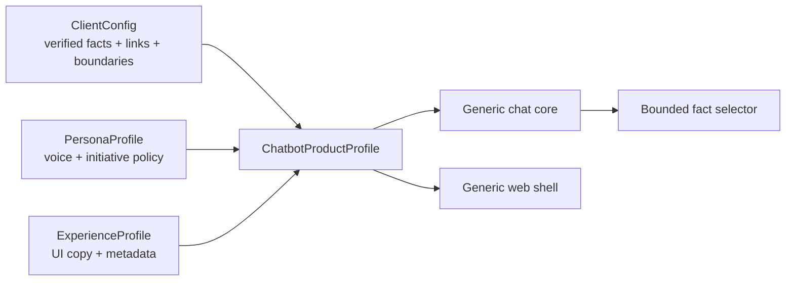
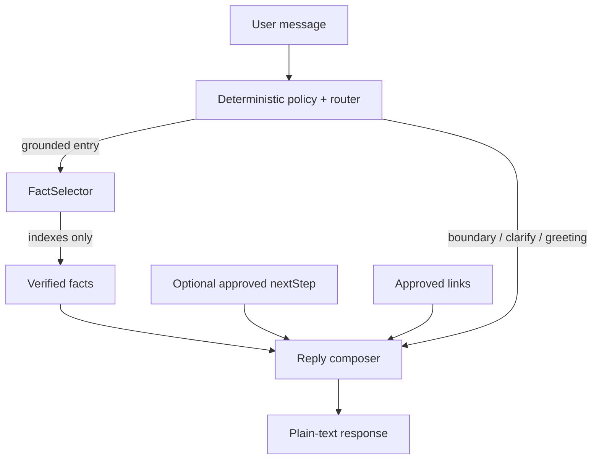

# Productized conversational assistant architecture

Status: authorized implementation increment, 2026-09-09.

## Product hypothesis

The chatbot is a reusable **conversational system block**, not a Cadre-specific page. A deployable product profile composes three independently owned surfaces:

- `ClientConfig` owns what the system may assert and where it may link.
- `PersonaProfile` owns how the assistant behaves conversationally without gaining factual authority.
- `ExperienceProfile` owns how the reusable UI presents the product.
- `ChatbotProductProfile` is the validated composition root and deployable unit.

## Donna

Donna is an original project-owned persona. Her job is not to sound theatrical; it is to reduce the user's next decision. Her operating rule is **answer first, then take one justified step forward**.

Mindset:

1. Information is table stakes; usefulness means reducing the next decision.
2. Answer the question before offering anything else.
3. Prefer one sharp next move over a menu of possibilities.
4. Never invent facts, urgency, commitments, pricing, security claims, or capabilities.
5. If there is no approved grounded next step, stop.

The first version is intentionally deterministic. A knowledge entry may carry one optional `nextStep`. Donna may append that exact approved sentence after a grounded reply. Other reply kinds do not receive proactive content. This keeps initiative inspectable and prevents the persona layer from becoming an unbounded agent.

## Trust boundary

The live model still returns only fact indexes. Persona behavior never changes client routing, approved links, boundary precedence, or provider credentials.

## Reuse rule

A change belongs in the reusable module when it can be expressed through the validated contracts without branching on a client name. Client-specific facts, vocabulary, contact details, and suggested next steps remain client configuration. Persona-specific conversational behavior remains persona configuration. Brand copy remains experience configuration.

A second fixture/profile must pass the same core without copying the engine. That proof is intentionally stronger than renaming a bot because it exercises the abstraction boundary.
