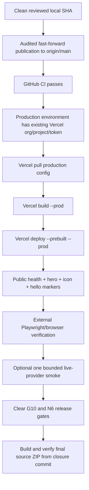

# Release runbook

Purpose: finish the current Cadre AI chatbot release without confusing local readiness with public delivery.

## Current release state

Software development is locally verified. The remaining blockers are external delivery controls:

| Gate | Current state | What clears it |
|---|---|---|
| Core N6 release | BLOCKED | Current reviewed SHA must be deployed and publicly reverified |
| G10 CI/CD deploy-check | BLOCKED | Existing Vercel project binding + production secrets + successful exact-SHA deployment |
| GitHub remote activation | BLOCKED | Dedicated audited publication channel receives its platform-managed GitHub credential |
| G9 Chrome preview | DONE | No further action required for core release |
| G11 n8n contract | DONE | Real email delivery is optional and not a core release requirement |

Do not create a new Vercel project or temporary demo URL merely to make the status green.

## Release flow



## 1. Preflight the candidate SHA

From a clean checkout/worktree:

```sh
git status -sb
git rev-parse HEAD
npm ci
npm run lint
npm run typecheck
npm test
npm run build
npm run test:e2e
node extension/build.mjs
npm exec -- vitest run --config extension/vitest.config.ts
npm run graph -- validate
```

The default Playwright server owns port 3100. Stop an old verifier-owned Next server before running E2E; do not kill unrelated processes blindly.

## 2. Publish source through the audited path

The local branch must fast-forward `origin/main`; no force push and no history rewrite.

Use the platform-managed/audited Git publication action. If it reports a missing injected token, record the blocker and stop. **Do not expose or reuse a shell token as a workaround.**

After publication, verify GitHub sees the expected exact SHA and both workflow files.

## 3. Confirm Vercel binding

Target is the existing `Cadre_AI / cadre-ai3` project `cadre-ai-chatbot`.

The GitHub `production` environment must provide these secret names:

- `VERCEL_ORG_ID`
- `VERCEL_PROJECT_ID`
- `VERCEL_TOKEN`

Do not store values in the repository, logs, evidence, screenshots, or chat.

The production workflow deliberately constructs only an ephemeral `.vercel/project.json`; it does not call `vercel link` or create a replacement project.

## 4. Deploy the exact CI-approved SHA

The committed workflow performs:

```text
vercel pull --environment=production
        |
        v
vercel build --prod
        |
        v
vercel deploy --prebuilt --prod
```

The `--prebuilt` step matters: the artifact built under the reviewed production configuration is the artifact sent to Vercel.

## 5. Verify release markers

A deployment is not accepted merely because the provider reports READY. Public checks must establish release equivalence.

Required markers:

- `GET /api/health` -> `{"status":"ok"}`.
- `/` contains the current Cadre Signal hero marker `Turn AI curiosity`.
- `/` does **not** contain the stale `YOUR NEXT STEP STARTS HERE` marker.
- `/icon.svg` returns the current SVG asset.
- Exact `hello` returns `kind: "greeting"` and the current deterministic welcome rather than the historical redirect.

The workflow already checks these. Retain its receipt.

## 6. Run public browser verification

Once the deployment URL is known and approved:

```sh
E2E_BASE_URL=https://THE-VERIFIED-DEPLOYMENT npm run test:e2e
```

External-server mode can reach the real API/provider. Confirm inference budget/authorization before running it. Keep local intercepted browser evidence and public browser evidence labeled separately.

## 7. Optional bounded live inference

Run only if the chatbot-only allowance remains valid. One small real roundtrip is enough to establish provider-path availability; it is not a benchmark. Record dated usage metadata without exposing the key.

The optional Gemini comparison is not required to release and must not delay closure.

## 8. Close Graph Harness gates

Only after the exact public deployment and required verification pass:

- append new deployment evidence;
- re-evaluate G10 `deploy-check`;
- re-evaluate N6 `release-check`;
- transition through supported states only;
- update `progress/checkpoint.md` and projections from the authoritative ledgers.

Never hand-edit the frozen baseline or relabel old BLOCKED evidence.

## 9. Build the final delivery ZIP

The previously tested ZIP is historical because source has changed since it was produced. Rebuild only from the exact closure commit.

Follow `docs/delivery.md`: fresh transport clone, no inherited hooks, usable `.git`, no `.env.local`, `.vercel`, `.codex`, dependencies, caches, generated build output, private inputs, or stale archives. Verify the **extracted ZIP**, not merely the working tree, with Git fsck, locked install, tests, lint, typecheck, build, smoke and checksum.

The final archive is preparation for submission; it does not itself authorize recruiting upload/email.

## Rollback

If the new deployment fails a mandatory marker:

1. retain the failed deployment evidence;
2. do not change tests to accept stale behavior;
3. identify whether the fault is source, environment, build, alias/promotion, or provider configuration;
4. restore the last known verified deployment using the authorized Vercel rollback/redeploy mechanism;
5. fix forward through a new reviewed SHA.

For provider-specific instability, explicit mock mode may be used for diagnosis, but never presented as a live release.

## Release owner checklist

- [ ] Local SHA is clean and all mandatory local checks pass.
- [ ] `origin/main` contains that exact SHA through the audited publication mechanism.
- [ ] GitHub CI passed for that SHA.
- [ ] Existing Vercel project binding is confirmed; no replacement project created.
- [ ] Production secrets exist only in the authorized secret store.
- [ ] Exact prebuilt SHA deployed.
- [ ] Health, hero, icon and greeting markers pass publicly.
- [ ] Public browser verification passes.
- [ ] Graph release gates updated from real evidence.
- [ ] Final ZIP rebuilt and independently verified from closure commit.
- [ ] Submission/upload remains a separate explicit human action.
